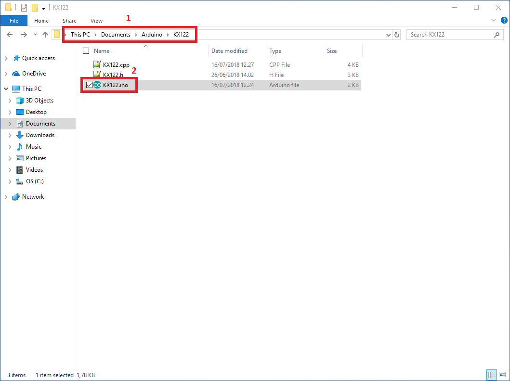
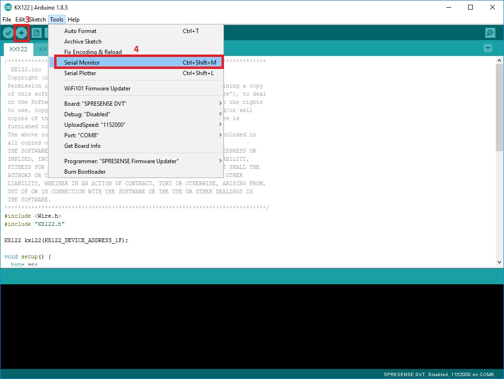
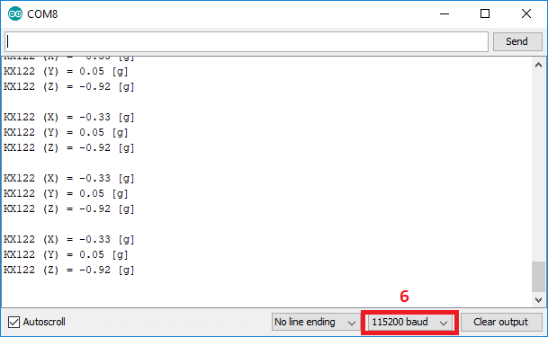

# Overview of this repository
Adruino libraries and samples for Rohm Sensors &amp; Bluetooth LE

# Supported devices
* Accelerometer KX122, I2C, SAD=0x1F
* Accelerometer KX224, I2C, SAD=<B>0x1E</B>*/0x1F
* Magnetosensor BM1422AGMV, I2C, SAD=0x0F
* Pressure sensor BM1383AGLV, I2C, SAD=0x5D
* Color sensor BH1749NUC, I2C, SAD=0x38/<B>0x39</B>*
* ALS/Proximity sensor RPR-0521RS, I2C, SAD=0x38
* Hall Effect sensor BD7411G, GPIO
* Bluetooth LE MK71251-02, UART

*Boldened is default device address 

# How to setup and test devices with Sony Spresense

About Sony Spresense
https://developer.sony.com/develop/spresense/

 For help regarding the installation of the Arduino IDE please refer to
 [Setting up the Arduino IDE](https://developer.sony.com/develop/spresense/developer-tools/get-started-using-arduino-ide/set-up-the-arduino-ide/ "Title")

 The sketches for the examples are located in the same directory as the drivers.
 
###  Installing the sensor & BLE example sketches ###

1. Place the example sketches inside your Arduino folder, which should be located in your users documents folder.
2. Open the folder of the example you want to test, and open the sketch file. The Arduino IDE should start with the selected sketch open.

3. You can then proceed to upload the example sketch to your Spresense board by clicking <B>Upload</B>
4. After the sketch has finished uploading, open the serial monitor by clicking Tools -> Serial Monitor or use the hotkey Ctrl+Shift+M. 

5. The sketch should start running, if not, please reset the board by pressing the reboot button on the main board.
6. To receive the correct data on the serial monitor, please ensure that the baud rate on the serial monitor is set to 115200.

